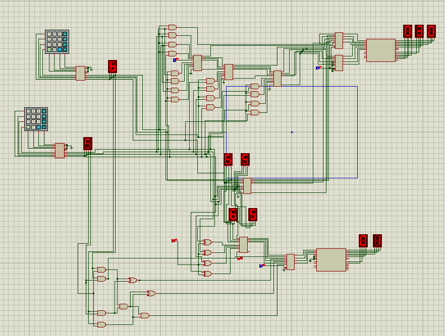

# 4-Bit ALU

A 4-bit Arithmetic Logic Unit (ALU) designed and simulated using digital logic circuits.

## Overview

This project implements a 4-bit ALU capable of performing multiple arithmetic operations on two 4-bit binary inputs.

### Supported Operations

- Addition
- Subtraction
- Multiplication
- Division

## Features

- 4-bit input A
- 4-bit input B
- Multiple arithmetic operations
- Binary output
- Digital logic based implementation
- Proteus simulation


## Circuit



## Project Structure

```text
Proteus/        → Proteus simulation files
Circuit_Diagram/ → Circuit diagrams
Documentation/  → Project report
Truth_Tables/   → Operation truth tables
Images/         → Project images
